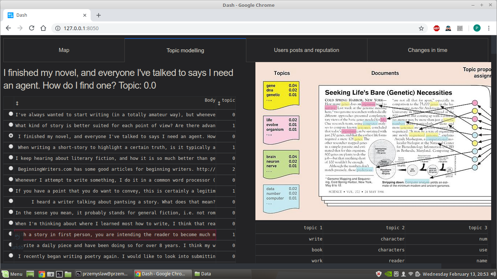

# Analysis of stack exchange data

## Instructions
Data can be downloaded from https://archive.org/download/stackexchange and should be saved and unpacked in `data` directory.

## Project
In this project we analyzed data from stack exchange forums (writers, movies and science-fiction). We created interactive map with every user's location and their data visible after clicking on them, did some interactive visualisations (changes of popularity in time and how users's reputation correlates with writing better posts) and did unsupervised topic modelling of all posts using method called Latent Dirichlet Allocation (see `notebooks/lda_topic_modelling.ipynb`).

## App
We presented our results in an web app made using dash. You run it with `python app.py`. I really recommend playing around with interactive map. Here are some screens:

### Map

Each user with location is represented on a map. We show users with high reputation (reputation corresponds to size and color of a dot). 

### Topic modelling with Latent Dirichlet Allocation

We found that we can assign a topic to each post and that 3 topics quite well describe our data.
* topic 1: people picking up writing trying to find some tips
* topic 2: questions about stories, people's characters in novels etc.
* topic 3: more technical questions about which tools to use

It is worth to explore higher number of topics and find interesting clusters in data. We think that this method is a really good way to deal with large amount of text and categorizing it in an unsupervised fashion.

### Interactive visualisations

